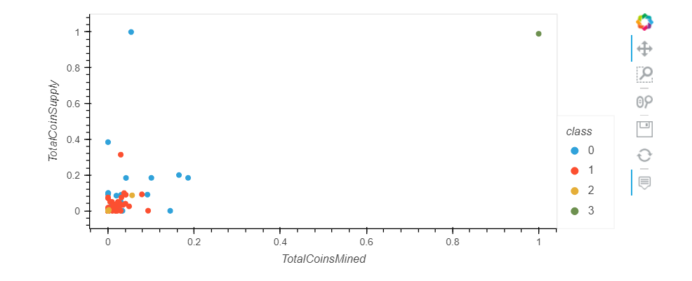
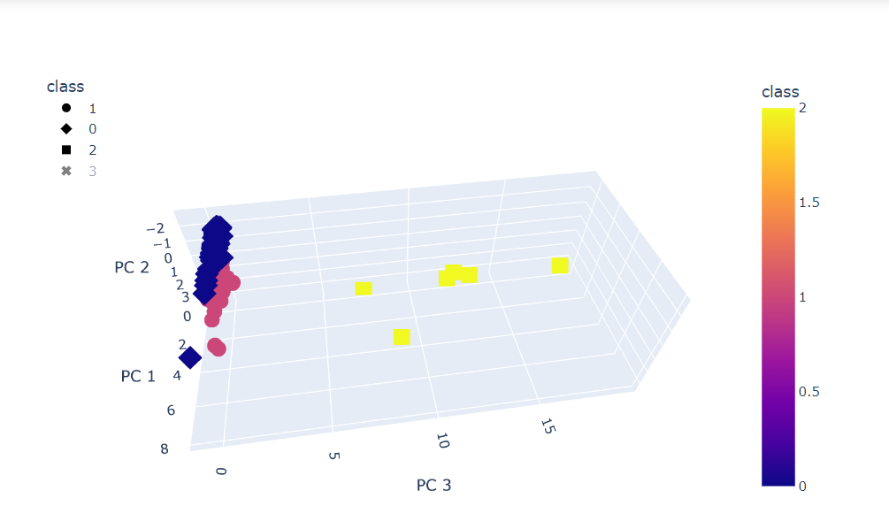

# Cryptocurrencies
## Overview
In this analysis we preprocess our data set to prapare our data for analysis. We understand different cryptocurrencies and understand differenct clusters and classes each falls under and glean new information from our datasets.

### Results
Below are our scatter plots created using KMeans and PCA:  

### Summary
Our analysis helps us to divide our data set into clusters that were determined by class. With our visualization created we can provide this for clients to make education decisions about which cryptocurrencies to trade.
